# Project Astra 美术基调与资产制作规范

版本 1.0 · 2026-09-22 · 分支 Art_Shader · 提交 5545069

## 01 Project Astra 美术基调与资产制作规范

以当前可运行场景为基础，为 Shader、3D 模型、2D 资产和后续生成流程建立共同标准。

**建议基调**  被反复修补的廉价工业探测舱。用低多边形块面、旧搪瓷、有限色阶和克制网点，表达“人被当作耗材”的处境；少量私人物件保留人的温度。

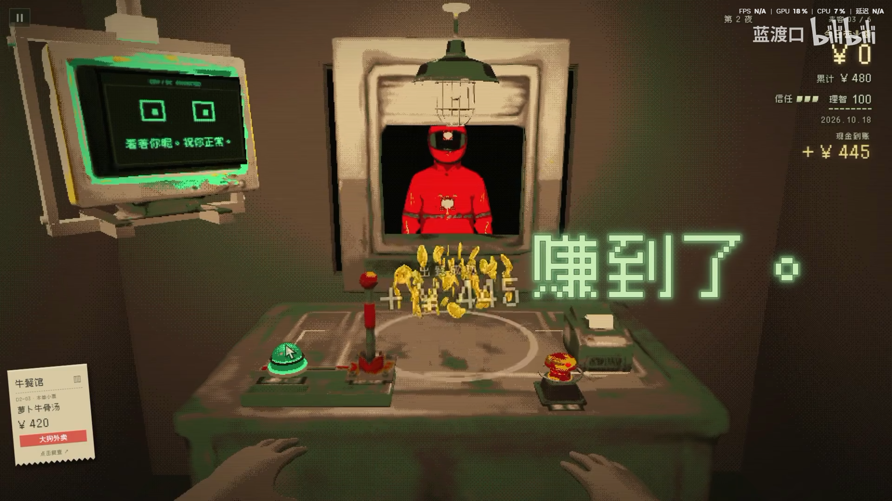

**不是缺少一个万能 Shader。**
当前已具备旧化材质、CRT 和调色。真正要统一的是表面细节尺度、光影层级、造型语言与界面。

第一步先做 A 墙样板：减少随机锈蚀，收敛高光，整理灯光，再比较有限色阶与有序抖动。样板定下后再批量生成资产。

制作取向：小团队可落地，效果与性能平衡。保留 Unity 2022.3 Built-in 管线，先验证既有技术上的改造。

阅读路径  02–05 现状与方向  ·  06–09 参考图谱  ·  10–15 造型与渲染  ·  16–22 资产制作  ·  23–26 落地与来源

## 02 参考图真正成立的视觉关系

观察到的视觉特征与推测的实现方法分开。仅凭截图不能确认原作使用了哪一个 Shader。

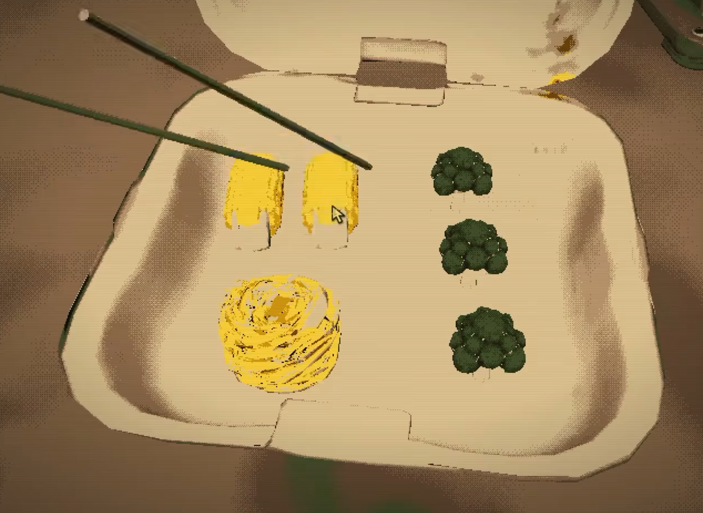

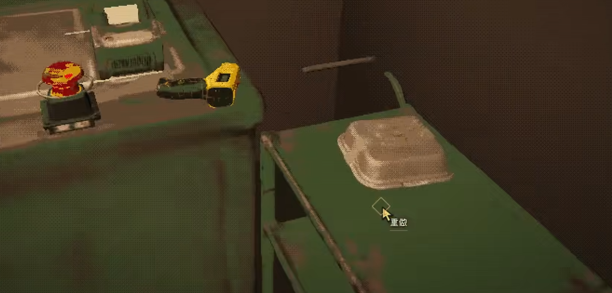

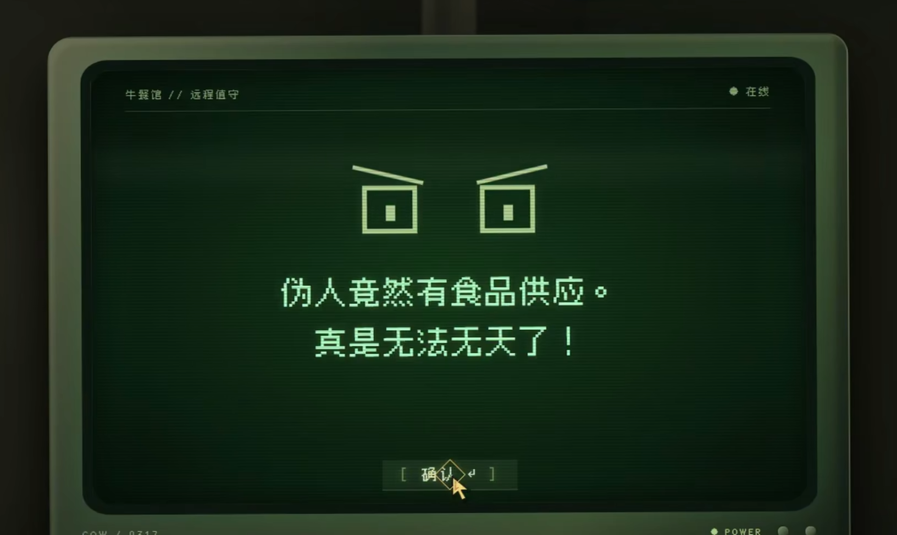

**块面与有限色阶**  物体主要靠大轮廓、少量倒角和清楚的阴影面成立。不同材质的表面信息量接近，不存在一块极细腻、另一块完全空白的突兀跳变。

**网点与像素是不同的东西**  图 1 的墙面暗部可见规则点阵；轮廓也带有离散像素。可用有限分辨率、色阶量化和有序抖动去接近，但网点也可能来自其他实现。

**旧化有位置**  掉漆集中在边缘、接触区和接缝附近；完整漆面仍构成主色。光照制造块面，磨损补充故事。

**软件界面单独设计**  像素字、扫描线、荧光色、边框比例共同形成 CRT。不会因为 3D 世界加了后处理，就自动得到一致的电脑桌面。

## 03 当前四面墙已经有好的空间骨架

本次实机截图来自当前分支源码的隔离构建。主项目未改动。四面墙的功能划分和固定中心观察是应保留的资产。

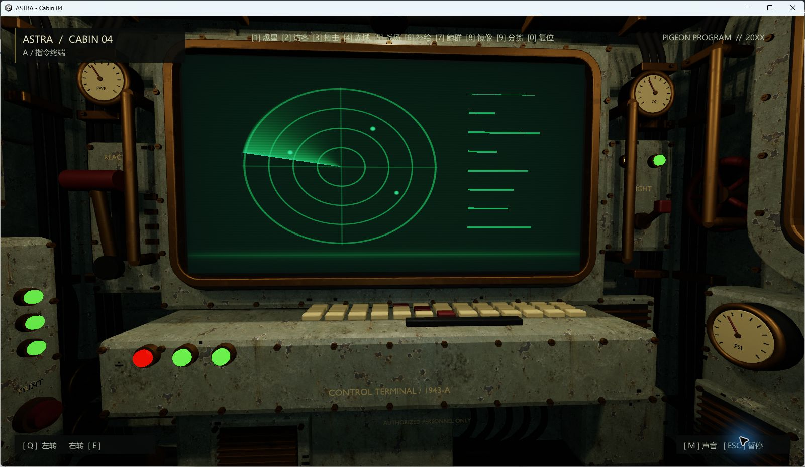

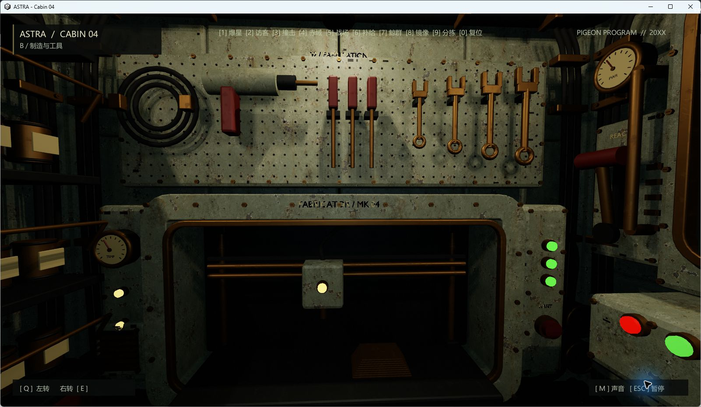

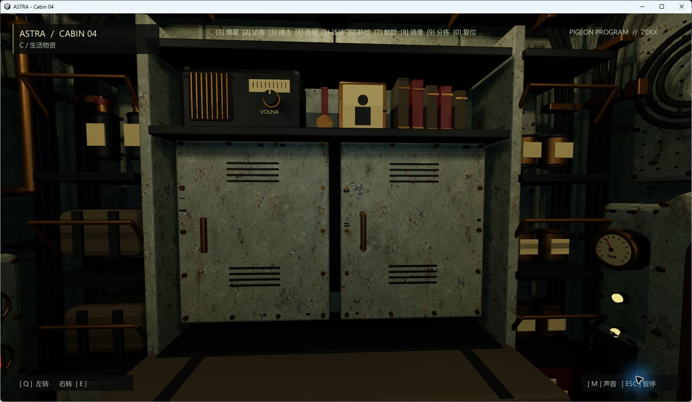

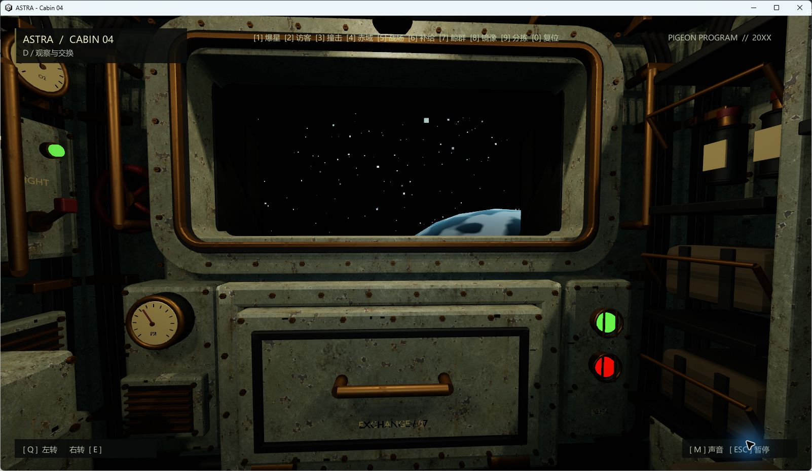

## 04 差距应按画面影响排序

这是美术判断的优先级，不是测量得出的百分比。问题要先在固定机位对照中验证，再决定是否扩展到全项目。

| 优先级 | 画面现象 | 应采取的美术动作 | Shader 能负责什么 |
| --- | --- | --- | --- |
| P0 | 墙板和设备表面细碎锈蚀过密 | 保留大面积完整漆面；脏污按受力、触摸、渗漏位置布置 | 减少高频采样贡献，接入有位置的磨损遮罩 |
| P0 | 主体、背景和可操作件层次接近 | 每面墙一个主焦点；降低背景反差；暗处仍能读轮廓 | 限制高光并统一色调，不能替代构图 |
| P1 | 黄铜连续高光偏亮，按钮像纯色光斑 | 把大部分外壳归入哑光涂层；发光只留小中心 | 材质响应、发光限幅与轻度光晕 |
| P1 | 标牌文字碎裂，部分管线阴影有锯齿感 | 先排查共面、阴影偏移和字牌尺寸，再做样式化 | 避免把渲染瑕疵当成刻意像素风 |
| P1 | 3D 屏幕与电脑桌面是两套视觉系统 | 统一荧光色、字体、网格、状态反馈和效果遮罩 | CRT 分层合成；相机滤镜覆盖不到全部 IMGUI |
| P2 | 外景生物更光滑，事件颜色密度偏高 | 共享块面和色阶逻辑；每次演出只突出一个异常 | 对外景应用可控的共同色阶，保留必要光效 |

结论：Shader 是重要的统一工具。先减掉相互冲突的细节，再用渲染强化风格，比在当前画面上直接叠加强烈像素滤镜更可控。

## 05 确定一种可以长期生产的美术基调

工业刑具的功能逻辑，旧设备的材料语言，少量私人物件的温度。所有新资产都应能回答它在舱里承担什么功能。

建议工作色板（sRGB 设计样本，不是直接复制到线性 Shader 的数值）：煤灰黑 #202521；舱壁灰绿 #596452；旧搪瓷白 #C8BE99；褐色黄铜 #8C7044；安全暗红 #983E31；荧光浅绿 #A8CE89；异常冷青 #609BA5

**主色分工**  灰绿与煤灰构成大面积结构；米白用于铭牌、仪表和主要设备；黄铜只在接头和表圈出现。红色指向危险或强操作，绿色指向正常状态，冷青留给窗外异常。

**造型关键词**  压铸壳、厚门框、短粗手柄、嵌入式仪表、保护笼、外露维修接口。转角用一段可读倒角，细节围绕机械功能排列。

**磨损关键词**  抓握磨亮、边角掉漆、螺钉周围锈迹、修补件色差、重复编号。避免把全舱铺成均匀锈场；廉价来自结构和制造方式，也来自替换痕迹。

**画面情绪**  日常是沉闷但能工作；警报是秩序被打断；鲸群等奇观用缓慢运动、遮挡和尺度反差出现。明亮与温暖应稀少而具体。

色彩面积起点：约 70% 低饱和结构色、25% 功能材质、5% 信号色。它是取舍工具，不要求逐像素满足比例。

## 06 设备如何成为画面的主角

这两项主要补充近距离设备、局部照明和生活痕迹。以下“借鉴点”均为本项目的视觉分析，不是原作开发方法的声明。

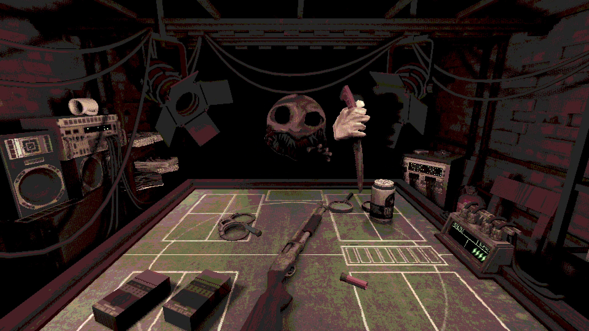

**Buckshot Roulette**

桌面占据视觉中心，外围器材被压暗，少数交互物拥有清楚轮廓。观察重点是局部光与触手可及的操作空间。

**落到 Astra**  B 墙的维修锤、A 墙的主拉杆可以获得类似的形体权重；周边工具降低对比。

**边界**  不复制角色、枪械或桌面布局；不把恐怖等同于全屏脏暗。

来源：https://store.steampowered.com/app/2835570/

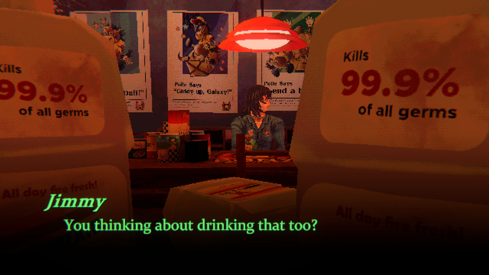

**Mouthwashing**

生活用品与企业宣传共享同一狭窄空间。粗糙形体、有限细节和有色光源形成统一的旧船舱气质。

**落到 Astra**  让 C 墙出现可辨认的纪念物、配给包装和机构标识；每件物品承载一条生活信息。

**边界**  不借用原作商标、海报或人物；不复制其高强度叙事色彩作为常态。

来源：https://store.steampowered.com/app/2475490/

## 07 受限空间如何保持可操作性

压迫感应来自空间与功能关系。关键读数和操作件仍需在日常、警报与断电状态下被识别。

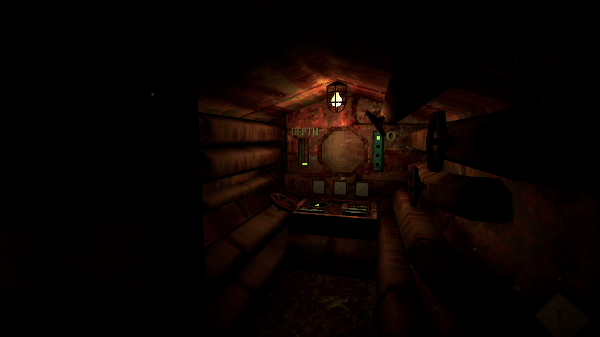

**Iron Lung**

狭窄纵深、低信息量表面和有限灯源制造压迫感。机器本身界定玩家能接触的世界。

**落到 Astra**  D 墙保留厚窗框作为前景遮挡；用距离和剪影使窗外巨大物体成立。

**边界**  不复制其长期极暗的可视条件；Astra 有阅读、维修和持续操作的需求。

来源：https://store.steampowered.com/app/1846170/

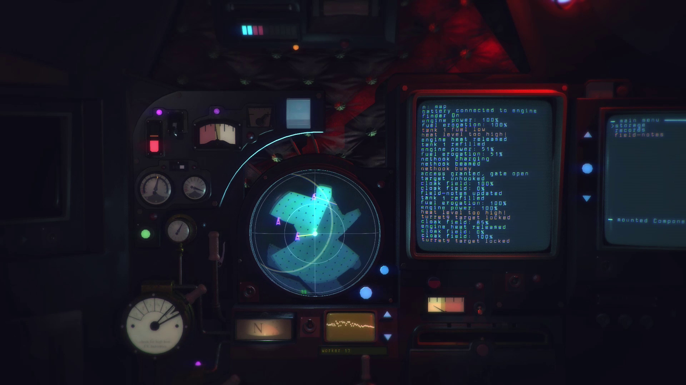

**Nauticrawl**

按钮、圆形仪表和显示器拥有不同尺寸与分组。仪器排布帮助玩家区分功能和优先级。

**落到 Astra**  A 墙把信息分为主显示、仪表监测和紧急控制；用机械分区代替堆满按钮。

**边界**  只借设备组织和操作感；其柔滑光效与蓝光比例不作为本项目材质目标。

来源：https://store.steampowered.com/app/922100/

## 08 低模的价值在于统一的细节尺度

“Low Poly”不是统一减面。大轮廓可以粗，近距离的握柄、铰链和读数仍需要专门设计。

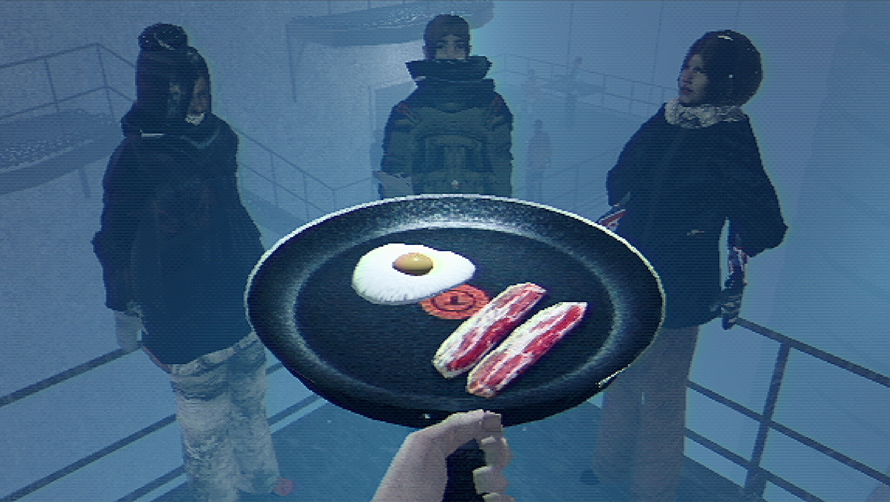

**Arctic Eggs**

低模人物、普通器具与有色环境共同构成粗粝而日常的科幻空间。轮廓和色块维持主体辨识。

**落到 Astra**  工具、手持件与来访者采用一致的块面尺度；皮肤和布料避免比舱壁更写实。

**边界**  不整体照搬其蓝紫色照明；Astra 的常态仍是灰绿、米白与暖灯。

来源：https://store.steampowered.com/app/2763670/

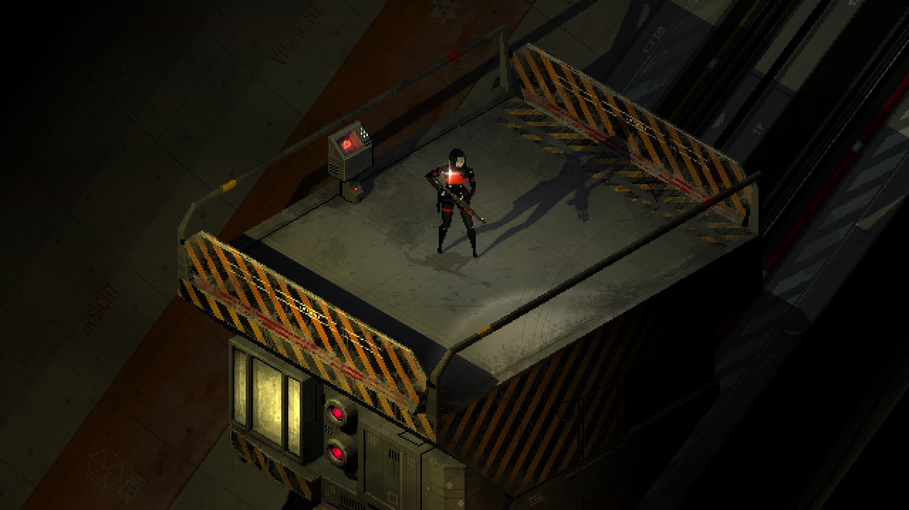

**SIGNALIS**

建筑大块面、重复工业标记和少量亮区组织视线。画面的信息密度与低分辨率语言相互配合。

**落到 Astra**  把警戒条纹、编号、窄竖灯和明确投影作为同一套空间标识。

**边界**  不直接搬用等距视角、角色造型或标识图案；我们以近距离第一人称为标准。

来源：https://store.steampowered.com/app/1262350/

## 09 终端应该像同一台旧设备

软件效果先服务信息。CRT 弯曲、扫线和残影都不能改变点击位置、中文阅读或战斗预警的可靠性。

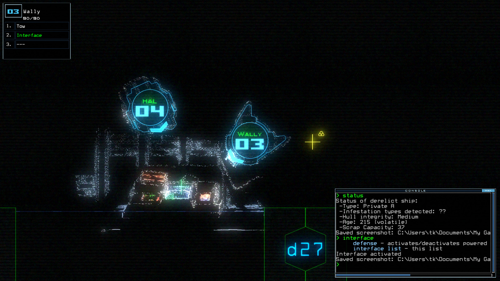

**Duskers**

有限颜色的示意信息、状态文本和传感器图像共同构成操作系统。画面留黑，使少量信号有意义。

**落到 Astra**  战斗和扫描使用简化轮廓、可追踪符号、明确敌我状态；噪声只发生在需要表达信号质量的区域。

**边界**  不原样复制命令系统或高密度英文布局；中文需要更大的可读空间。

来源：https://store.steampowered.com/app/254320/

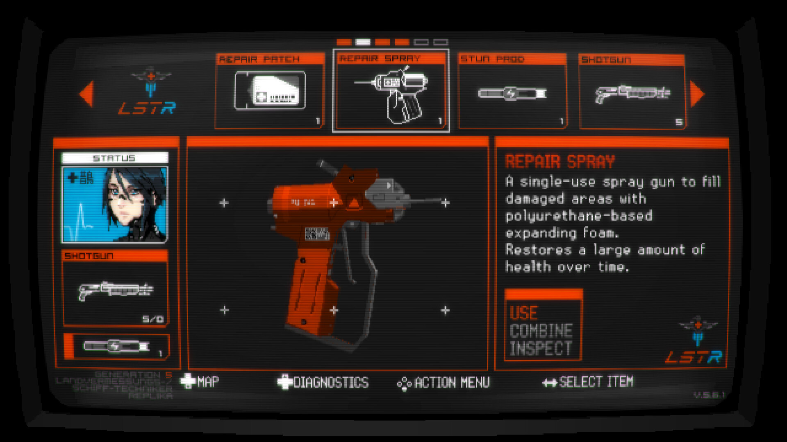

**SIGNALIS**

物品、编号、说明与边框共享规则网格，暖色强调明确功能层级。图标有可辨认的轮廓。

**落到 Astra**  文件、档案、资源、战斗应用共用间距与选中态；图标先做单色剪影，再加状态。

**边界**  保留 Astra 现有桌面功能；不复制原作配色、物品图或整个界面框架。

来源：https://store.steampowered.com/app/1262350/

## 10 四面墙各有一个视觉职责

保持 A 软件 B 工具 C 生活 D 窗口的功能分区。当前模型清单尺寸为 3.2 × 3.2 × 2.5 米；不要按早期概念尺寸盲目缩放。

| 墙面 | 第一眼要看到 | 第二层信息 | 应简化的背景 |
| --- | --- | --- | --- |
| A 指令 | 主显示器与一处警报 | 主拉杆、氧气及电力读数 | 屏幕周围同强度的高光、装饰螺钉与重复灯 |
| B 工具 | 可拿起的维修锤与打印工作区 | 工具收纳秩序、设备状态 | 相近尺寸的工具等距排队；后板锈点与孔洞叠加 |
| C 生活 | 一件有叙事意义的私人物件 | 配给、收音机、储物柜 | 均匀空白标签、同色罐子和大面积重复锈蚀 |
| D 观察 | 被厚窗框限定的外部异常 | 交换舱门与阀轮 | 与窗口争夺注意力的按钮饱和色和过亮边圈 |

**固定机位是制作优势。**  每面墙先存一张中心截图，再存左右鼠标偏移和近窗截图。前景边框、主体设备和背景管道形成三层深度；细节预算按这些画面分配。

当前基础 FOV 为 74°，眼高为 1.28 米。先保持镜头不变进行 A/B；若要调整，单独测试，不把镜头改变与 Shader 改变混在一起。

## 11 造型先决定轮廓和制造方式

以主形 70% 功能结构 25% 细节 5% 作为建模审稿起点。它是面积与注意力的取舍建议，不是三角面配额。

原创结构示意  仅说明轮廓、比例与材料分区，不代表已制作模型或引擎渲染。

**大轮廓**  厚边框、短粗操纵杆、扁平箱体、嵌入式表盘。大多数边缘只需一段倒角，圆管常以 8–12 边起步，近镜主件再提升。

**功能细节**  螺钉用于说明拆装，孔洞用于散热，握柄留出手的空间。先画清铰链、转轴和运动范围，再添加磨损。

**一致性**  已有精度足够的模型不为“低模”而破坏。将细分预算投入剪影、近景圆边与活动结构，平整背面和隐藏面保持简单。

## 12 材质分成少量可复用的家族

先做材质球与 A 墙实景样板。以下数值是建议试验起点，不是原参考游戏的参数。粗糙度与 Unity Smoothness 约为互补关系。

| 家族 | 外观与叙事 | 建议响应 | 细节规则 |
| --- | --- | --- | --- |
| 灰绿搪瓷 | 舱壁和一般设备的主色 | Metallic 0–0.1；Smoothness 0.15–0.3 | 保留完整漆面；边角及螺钉附近少量掉漆 |
| 旧米白涂层 | 主设备、铭牌、仪表背景 | Metallic 0；Smoothness 0.12–0.25 | 阴影稍暖；不可大面积发白或污成灰绿 |
| 裸黄铜与钢 | 接口、表圈、受力件 | 裸金属区域 Metallic 0.7–1；Smoothness 0.2–0.4 | 一到两块可读高光；氧化区使用独立遮罩 |
| 橡胶与帆布 | 握把、防护线、软包 | Metallic 0；Smoothness 0.03–0.15 | 靠轮廓、褶皱和颜色区分，避免金属微法线 |
| 纸张与贴花 | 配给、私人记忆、机构标签 | Metallic 0；Smoothness 0–0.1 | 正文后期排字；污染避开重要文字 |
| 屏幕与玻璃 | 信息输出和舷窗 | 独立 Emission 或玻璃材质 | 屏幕只在亮字附近柔和溢光；窗玻璃不遮住外景 |

**先改主贴图，再调 _Wear。**  当前主颜色贴图贡献为 0.88，旧化已经画在颜色里。把程序掉漆参数设为零，仍然会留下密集斑驳。

## 13 现有 Shader 的能力和缺口

审计对象为仓库中的实现。这里列的是已读到的代码事实；参考图的算法归因仍需实测验证。

| 实现 | 当前行为 | 与目标的关系 |
| --- | --- | --- |
| WornMetal.shader | Standard 光照；世界空间三向投影；主贴图、微法线、粗糙度与程序噪声 | 有材质基础，但不是有限色阶的风格化光照；世界投影在活动物体上也应检查纹理滑动 |
| HullPaint.mat | _TextureStrength 0.88；_DetailStrength 0.78；_BumpScale 0.28 | 颜色与微表面贡献较强。可先做低细节样板验证，不必重写全部材质 |
| CabinGrade.shader | 曝光、近似 ACES 曲线、暗角、极轻随机颗粒 | 已有调色；没有明确的限色、稳定有序抖动或统一低分辨率阶段 |
| CRT.shader | 程序雷达、扫描线、移动亮带、暗角与闪烁 | 服务 3D 屏幕，不等于整个桌面经过 CRT 渲染 |
| CabinComputer.cs | IMGUI；操作系统字体回退；1360 × 780 逻辑桌面 | 并非像素字库；相机 OnRenderImage 的扩展不能直接保证覆盖桌面 |
| CabinBuild.cs | 每墙点光加聚光，均有软阴影；额外环境补光；ForcePixel | 画面和成本都值得整理。先减少重叠动态光，而非仅凭低模判断性能 |

算法原理示意  抖动在相邻色阶之间分配像素，以点阵表达过渡；这是原创合成色带，不是游戏改造前后效果。

技术依据：Unity 2022.3 Built-in 的 OnRenderImage 可处理相机图像；Forward 的额外逐像素灯会增加渲染工作。版本相容性先于采购 Shader 插件。 [T01–T02]

## 14 先用两个小试验确定渲染路线

保留现有场景和机位，用同一张灰卡、同一组材质球与 A 墙对照。不要把资产重做、镜头变化和色阶变化同时混入一次比较。

| 试验 | 固定的基础 | 变化项 | 判断 |
| --- | --- | --- | --- |
| A 低成本统一 | 当前模型与 Built-in；先减少贴图高频、调整灯光 | 在现有调色之后加入可控色阶与固定 4 × 4 有序抖动 | 若主要目标已成立，就保留这条路线 |
| B 加入材质光照分段 | 沿用 A 的资产、机位与色板 | 主设备的漫反射约 3–5 档；限制高光形状；材质差异仍保留 | 仅在 A 仍显得过度平滑或发塑料光时推进 |
| C 极端效果边界 | 同一场景截图 | 640 × 360、800 × 450、原分辨率分别比较；扫描线单独开关 | 排除文字破坏、星点闪烁、锯齿晃动和严重色带 |

**推荐顺序**  场景光照 → 3D 色调映射 → 有限色阶与有序抖动 → 上采样 → 独立桌面 CRT → 清晰的辅助文字与光标。

抖动应参与相邻色阶的选择，重点出现在过渡区，不能当作一张噪点图铺满画面。色阶优先按亮度或受控调色板处理，避免 RGB 各通道生硬量化导致色相漂移。

起点建议：常态弱抖动、无顶点抖动、无常驻色差。内部 800 × 450 可供 1600 × 900 整数放大；1280 × 720 可用 640 × 360。其他分辨率需验证缩放规则。

## 15 灯光与信号色承担明确任务

保留暖灯、冷补光与应急状态的叙事作用。光照调整以读图结果为准；不要把曝光增大作为解决黑暗区域的唯一办法。

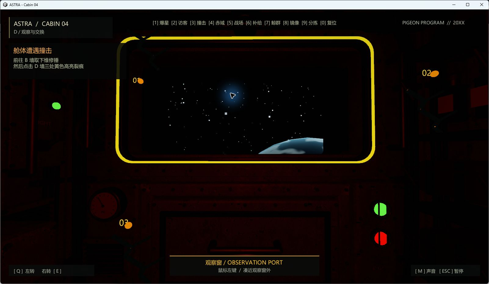

**日常**  主灯照亮一个工作区域，弱补光保住边界。投影描述结构；背景管线比控制件更暗、更低反差。

**应急**  红光提示空间进入异常，仪表白与有效交互提示仍可读。保留“颜色 + 符号 + 文字”的冗余提示。

**停电**  短时熄灯可以制造事件节奏；恢复可操作状态后，保证维修目标、工具和返回路径能定位。

**奇观**  窗外色只在事件中短暂影响舱内。优先一个补光及材质发光变化，控制透明层数。

制作建议：主工作灯用可控实时阴影；其他灯尽量不重复投影。静态 AO 只帮助接触关系，不能把可关闭灯的亮斑烘焙进颜色贴图。实验性烘焙方案需逐一验证断电与警报。

统一 Linear 项目的颜色转换路径：色板以 sRGB 编写，光照在线性空间计算，色调与量化明确所在空间。用灰阶与标准色块确认不重复 Gamma 转换。 [T03]

## 16 3D 资产按镜头距离分级

模型清单记录当前 FBX 为 141988 三角面，属于导出统计，不是运行时可见面数。先保住现有交互和轮廓，再分配新增资产预算。

| 资产级别 | 建议起步范围 | 贴图与材质 | 验收重点 |
| --- | --- | --- | --- |
| 主设备近景 | 每件约 2k–8k 三角面 | 通常 1k 图集；1–2 材质槽；确有需要再用 2k | 中央视角和近景均无明显剪影破坏；活动件独立 |
| 工具及中型道具 | 每件约 300–2k 三角面 | 256–512 或共享 1k 图集 | 一眼区分用途；握把、刃口和轴心清楚 |
| 背景小物 | 每件约 50–500 三角面 | 共享图集或顶点色；少量材质 | 不靠高频法线制造细节；成组后节奏统一 |
| 模块墙板与管线 | 按重复模块控制；优先实例复用 | 可平铺主材质 + 共用细节图集 | 接缝、密度和米制比例统一；角落不穿插 |
| 来访者与异常生物 | 按最大屏幕占比单独评审 | 先以轮廓、块面、少量发光测试 | 远处剪影成立；近景不突然变成另一种质感 |

这些是立项预算，不是生成器承诺，也不是合格与否的唯一标准。面数、材质槽、阴影和透明覆盖一起影响成本。保持预算弹性，把高成本花在玩家真正看见的地方。

交付至少包含：可编辑源文件、FBX 或 GLB、独立贴图、正侧背预览、尺寸与轴心说明、生成记录和来源许可。命名示例：AST_PROP_ValveWheel_01。

## 17 3D 生成先产部件再形成场景

生成模型是制作起点。多视图一致性、拓扑、UV、轴心和材质分区需要在 DCC 中复核，不能从提示词推定已经合格。

**1 写清资产卡**  功能、所在墙面、实际尺寸、最大屏幕占比、活动件、材料比例、三角面预算和安装接口。主设备一次一个，避免直接生成一整舱带灯光的图片。

**2 锁定结构参考**  先做中性光的正视、侧视、背视，保证同一物件结构一致。概念图中的螺钉和手柄必须解释其功能，不能在不同视图随意增减。

**3 生成并清理**  重拓扑或减面；修复穿插、背面和重复面；检查法线与 UV 密度；拆出门、手柄、指针和旋钮。平整大面保持低噪。

**4 接入标准材质**  复用搪瓷、黄铜、橡胶家族。颜色图不烘入动态阴影、高光、扫线或屏幕网点。静态 AO 作为独立可调数据。

**5 放回游戏验收**  先替换一个样板物件，在日常、断电、红警报和近窗观察中检查。验证运动、射线命中和遮挡，再允许同类批量生产。

**现有工程约定**  Unity 中使用米制与 Y 向上。参考导入映射为 (-x, z, -y)，实例缩放保持 (1,1,1)。不要直接照搬生成器坐标；用 1 米标尺和不对称测试物确认方向。

保留 ACT_LightSwitch、ACT_PowerLever、ACT_PrintButton、ACT_Cabinet、ACT_RadioKnob、ACT_Hatch、ACT_Valve 与 GAUGE 系列节点的交互语义。新命名必须同步绑定并验证，不能无提示替换。

## 18 3D 提示词应限制制造方式

把资产卡中的尺寸、功能和材料写入提示词；低模只是其中一个约束。完整可复制版本与验收模板见附带的《资产生成提示词与验收模板.md》。

**示例 A  壁挂维修终端外壳**

为 Project Astra 制作一个单独的壁挂维修终端外壳。冷战时期廉价工业设备的制造逻辑，灰绿搪瓷钢壳，厚边框、单段倒角、嵌入式 CRT 开口和可拆后盖。建议外形 0.55 × 0.42 × 0.22 米；最终以安装接口为准。

正交正面、侧面和背面保持结构一致；中性均匀照明，无场景、无戏剧性阴影。大面积漆面完整，边角和螺钉周围少量磨损。屏幕、按钮与壳体分开。铭牌留白，后期排字。

**排除项**  高精度写实扫描、满屏随机锈点、霓虹边条、圆润玩具比例、不可拆的一体按钮、烘焙光晕。

**示例 B  手动空气阀轮**

一个可旋转的三辐工业阀轮，暗红旧漆，中心轴套为氧化黄铜。轮廓短粗、能戴手套抓握；直径约 0.22 米作为初始提案。轮缘、辐条与轴套有合理的连接结构。

仅接触和凸起边缘出现磨亮。输出中性光多视图，明确中心转轴和背部接口。低模形体保留轮缘辨识，模型清理后进入统一搪瓷与金属材质家族。

**验收关键**  旋转时不穿墙，轮缘不变形，轴心正确，纹理不游动，缩到游戏里的实际尺寸仍能识别。

生成时可复用的英文锚点：low-poly industrial prop; broad planes; restrained edge wear; matte enamel; muted olive; functional construction; neutral orthographic views; no baked lighting.

## 19 2D 资产分成设备标识与软件界面

所有内容都属于同一世界，但有不同的阅读距离。字体、图标与排版应人工控制；生成器主要提供插图、图案和可清理的草案。

| 类别 | 建议规格 | 视觉要求 | 导出与验收 |
| --- | --- | --- | --- |
| 控制台图标 | 24 或 32 像素逻辑网格；统一线宽 | 单色剪影；默认、悬停、按下、禁用、警报五态 | 透明 PNG 或矢量源；整数倍显示，轮廓不抖 |
| 铭牌和设备贴花 | 按近景屏幕占比决定 256–1024 图集 | 米白底、煤灰字、少量暗红；文字避开污迹 | 文字人工排版；保留可编辑源与图集边距 |
| CRT 短文本 | 优先完整中文像素字库；12px 字形可试 2 倍显示 | 数字与状态严格对齐；中文、标点、拉丁字基线一致 | 字形覆盖测试；不依赖系统随机字体回退 |
| 档案长文本 | 保留清晰的阅读样式及字号缩放 | 较轻扫线或关闭扫线；行距足够；不让每段都闪烁 | 1280 × 720 实际窗口阅读测试 |
| 照片和档案插图 | 按用途保留 512–1024 原图，再做风格转换 | 限制颜色与细节频率；内容服务世界观 | 原图与入游戏版分开；记录来源与生成条件 |
| 战斗和扫描 | 轮廓、弹道、锁定、危险提示分层 | 色彩加形状编码；关键预警不被噪声遮挡 | 暂停、运动、低效果模式中保持含义一致 |

候选字库：Fusion Pixel Font 提供 8 / 10 / 12px 与 zh-Hans 字形，字体采用 OFL 1.1。先做中文样张再决定使用，随资产保留实际版本及许可。并非已有 16px 版本。 [T04]

## 20 电脑效果需要独立的合成入口

当前 IMGUI 桌面和 3D 屏幕不是同一张纹理。先统一设计参数，再决定逐步迁移或增加桌面专用效果层。

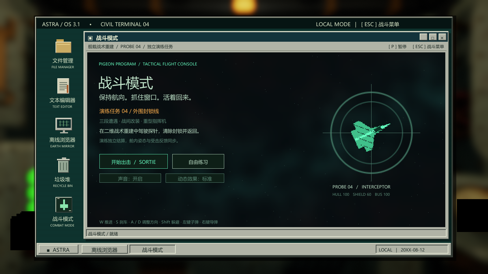

**第一阶段**  保留桌面功能，统一灰绿、米白、浅绿与暗红；统一间距、图标和像素字体短标签。扫描线先作为低对比叠加层。

**第二阶段**  需要完整弯曲、发光与残影时，再把桌面内容纳入专用 RenderTexture 或适合的 UI 渲染路径。迁移必须保住输入法、滚动、窗口与保存。

**效果限度**  扫描线的亮度变化先试 3%–6%；残影只作用于雷达或动态图像。文字与光标提供清晰模式。

**输入映射必须一致。**  若画面弯曲或缩放，点击坐标也必须使用对应的逆变换；否则视觉按钮与实际命中位置会分离。只做装饰性暗角或扫线时仍要保证边缘文字可读。

中文测试串：氧气 08%  ·  阀门未关闭  ·  剩余 12 分  ·  维修完成  ·  档案编号 A-04  ·  传感器失联。观察复杂汉字、百分号、零与字母 O 的区分。

## 21 2D 生成先出图形再排文字

生成图片不承担最终文字准确性。用统一图形语法、固定色板和版式，控制批量资产的一致性。

**配给标签插图**

单色工业丝网印刷风格图形，一个密封食品罐与简化人体轮廓并列，强调“配给给生物传感器”。煤灰色墨线、米白平底；大形状、少量实心黑块，边缘轻度印刷磨损。正视平面图，不要透视和投影，不生成任何文字、数字或商标。

生成后人工排入编号、净重、批次和警告语。把掉墨层与文字层分开，关键字段至少保留一个完整版本；同一机构只使用一套边距与字重。

**生物传感器状态图标**

为旧式飞船终端设计六个统一线条图标：氧气、供电、温度、通信、维修、人员状态。以 24 像素网格为目标草案，几何轮廓、单色、相同视觉重量、每格独立，不含文字，不画玻璃高光或外发光。

输出只作为草案；人工重绘到像素网格。先在 1 倍下检查，再做整数放大。各状态通过缺口、叉号、脉冲框或填充变化表达，不能只换颜色。

**档案图像**  机构宣传采用受控构图、少量色版与理性秩序；私人纪念图保留具体人物关系和不完美裁切。两者都经过相同的最终色调管理，但不要把所有档案统一成泛黄噪点。

详细负面约束、命名、分层交付和验收表见附带 Markdown。生产中的色阶、扫线和 CRT 光晕通常由引擎统一添加，不重复烘焙进每张图。

## 22 窗外奇观服从同一套画面语言

舱内是尺度参照。外景可以陌生，但造型细节、明暗分区和颜色数量应与舱内保持关系。

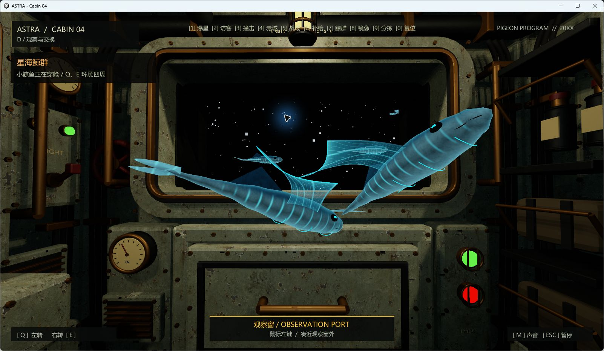

**普通太空**  保留足够黑场；星点按远近与亮度分组。最小星点在低分辨率与转头时需稳定，不以随机闪点增加噪声。

**生物与来访者**  先让大轮廓、运动和遮挡成立，再加鳍膜与发光。可减少细密条纹、保留几条有节奏的亮线。

**战斗与异常**  每个演出选一组主辅色；红警报不与常驻特效争夺含义。爆炸先形成明确闪光、主体和消散阶段。

下一轮至少复查：鲸群近景、撞击红灯、镜像探测舱、赤红眼魔、战斗弹幕。尤其检查全屏色阶对透明排序、星点、发光边缘和目标识别的影响。

本次实机检查覆盖四墙、近窗、撞击与鲸群。电脑界面及其他演出参考仓库资料，尚不声称已完成逐项动态验收。

## 23 性能与可读性同时成为验收条件

以下是建议的目标与测试方法，尚未在指定低配机器上测量。低模本身不保证低成本；多灯阴影、透明叠加和全屏效果更需实际分析。

| 维度 | 样板验收建议 | 发现问题后先做什么 |
| --- | --- | --- |
| 画面性能 | 先指定目标硬件；建议 1080p 输出争取稳定 60 fps，即帧时间约 16.7 ms；保留低效果档 | 用 Profiler 分离 CPU / GPU；对比关闭额外阴影、透明和后处理的收益 |
| 光照成本 | A/B 样板试验 1–2 个主要动态阴影源；其余灯关闭阴影或缩小作用范围 | 检查重叠灯与 ForcePixel；小幅改动后复看警报、断电与转墙 |
| 文本阅读 | 1280 × 720 与 1920 × 1080 下读懂中文状态、正文和控件；字号可调整 | 先调字号、间距与字库，再减扫线；不能靠加亮解决缺字 |
| 时间稳定 | 静止、鼠标视差、Q/E 转墙与近窗都检查规则网点和最小星点 | 抖动图案锁定渲染网格；避免时间噪声和多次过滤 |
| 交互回归 | 开关、打印机、柜门、阀轮、维修、输入法、窗口拖动、暂停与退出均可用 | 先核实碰撞、节点和输入映射；材质效果不应干扰命中 |
| 风格一致 | 同一新道具在四墙和所有灯态里仍像同一套资产 | 回到材质家族与主色板；不要给每件道具独立补一套滤镜 |

建议保留三种独立选项：场景像素化强度、CRT 效果强度、动态效果强度。低效果模式应保留信息含义和美术主色，不退回另一套杂乱的默认材质。

## 24 先完成一个样板再扩到全项目

把投入集中在能定标准的工作。以下是实施顺序与交付门槛，不是已经完成的改造或承诺工期。

| 阶段 | 具体工作 | 通过标准 |
| --- | --- | --- |
| 01 证据与基线 | 固定 A 墙、B 墙、D 近窗和桌面截图；记录材质、机位、灯光及效果开关 | 每次比较可复现；用户能一眼看出改动来源 |
| 02 A 墙样板 | 重做低细节搪瓷颜色层；收敛高光；清理铭牌；调整主灯与背景层次 | 不开像素化时已有主次；操作件与仪表可读 |
| 03 渲染对照 | A 方案后处理与 B 方案分段光照对照；试低分辨率、网点和清晰 UI | 静态截图接近参考，转墙不闪烁，文字不受损 |
| 04 资产标准件 | 终端壳、阀轮、工具、贴花、图标各做一个；形成材质预设与资产卡 | 后续生成能用同一套标准审核，避免逐件临时调风格 |
| 05 四墙与外景 | 按功能和屏幕占比替换；统一日常与异常灯态；复查特效 | 四墙、近窗、警报和软件像同一个项目 |
| 06 交付与回归 | 整理来源、生成记录、参数、可编辑源及质量档；在目标机验证 | 画面、交互、文字和性能均有记录；再开始批量生产 |

**最先交付的不是一仓库新模型，而是一张可信的 A 墙实机样板。**  它应同时定下材质、灯光、网点尺度、屏幕表现与铭牌尺寸，成为之后每份生成任务的共同参照。

## 25 参考来源与使用边界

外部截图是视觉研究材料。保留作者和来源，不作为可直接放进游戏的资产。视觉分析与原作实际技术实现须区分。

| 编号 | 作品 | 作者或开发团队 | 官方截图来源 |
| --- | --- | --- | --- |
| R01 | Buckshot Roulette | Mike Klubnika | https://store.steampowered.com/app/2835570/ |
| R02 | Mouthwashing | Wrong Organ | https://store.steampowered.com/app/2475490/ |
| R03 | Iron Lung | David Szymanski | https://store.steampowered.com/app/1846170/ |
| R04 | Nauticrawl | Spare Parts Oasis | https://store.steampowered.com/app/922100/ |
| R05 | Arctic Eggs | The Water Museum / cockydoody / abmarnie / Cameron Ginex | https://store.steampowered.com/app/2763670/ |
| R06 R08 | SIGNALIS | rose-engine | https://store.steampowered.com/app/1262350/ |
| R07 | Duskers | Misfits Attic | https://store.steampowered.com/app/254320/ |

外部图于 2026-09-22 从官方 Steam 商店的公开截图获取。原始图片文件、页面链接与图像 URL 均在《参考来源与图像清单.md》中逐项对应。

用户《美术案》包含四张参考图，未标注作品名称；本文件将其记为 U01–U04，不猜测原作和所用插件。图 1 保留原视频画面，字幕与水印不纳入设计目标。

## 26 工程依据与后续维护入口

所有建议的参数、预算与视觉规范都以样板验证为准。此文档为美术方向及生产规范；正式项目中的 Shader 和资产尚未被本次工作改造。

**检查依据**  Art_Shader 分支，提交 5545069。Git 目录 Build 缺少 exe，因此将 Assets、Packages 与 ProjectSettings 复制到隔离目录，用原场景构建 Windows 演示后查看。未用本地开发工作区的不同版本替代。

| 用途 | 仓库相对路径 |
| --- | --- |
| 渲染与材质 | 3D Demo/UnityProject/Assets/Astra/Shaders/WornMetal.shader CabinGrade.shader 与 CRT.shader 位于同目录 |
| 相机与桌面 | 3D Demo/UnityProject/Assets/Astra/Scripts/Runtime/CabinPresentation.cs CabinComputer.cs 位于同目录 |
| 场景与重建 | 3D Demo/UnityProject/Assets/Astra/Scenes/Cabin04.unity 3D Demo/UnityProject/Assets/Astra/Editor/CabinBuild.cs |
| 模型与贴图依据 | 3D Demo/Source/model_manifest.json 3D Demo/Source/material_generation.md 3D Demo/UnityProject/Assets/Astra/Materials/HullPaint.mat |

[T01 Unity 2022.3 OnRenderImage](https://docs.unity3d.com/2022.3/Documentation/ScriptReference/MonoBehaviour.OnRenderImage.html)

[T02 Unity 2022.3 Forward Rendering](https://docs.unity3d.com/2022.3/Documentation/Manual/RenderTech-ForwardRendering.html)

[T03 Unity 2022.3 Linear or Gamma Workflow](https://docs.unity3d.com/2022.3/Documentation/Manual/LinearRendering-LinearOrGammaWorkflow.html)

[T04 Fusion Pixel Font 字库与许可](https://github.com/TakWolf/fusion-pixel-font)
