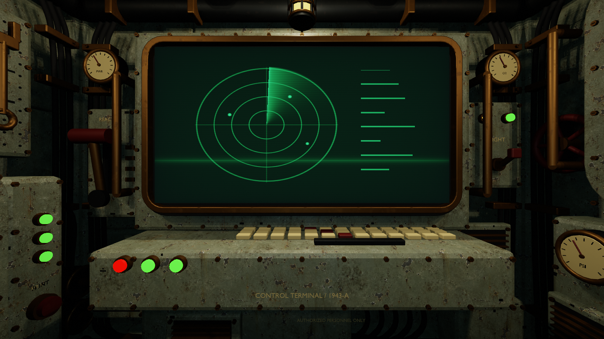
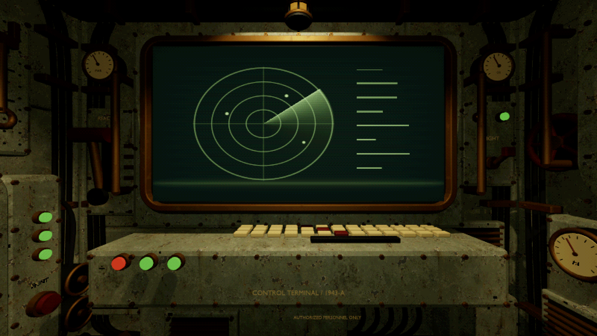
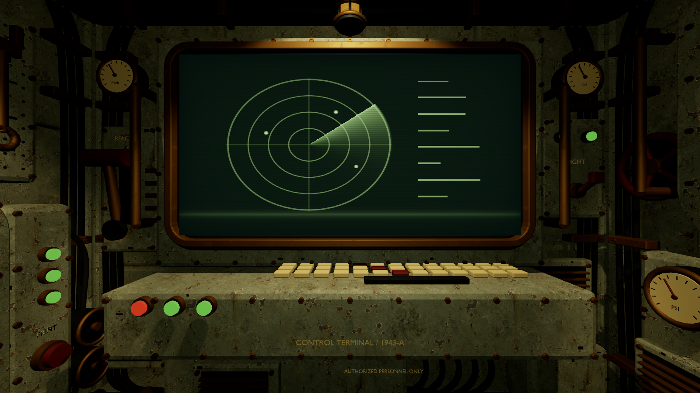
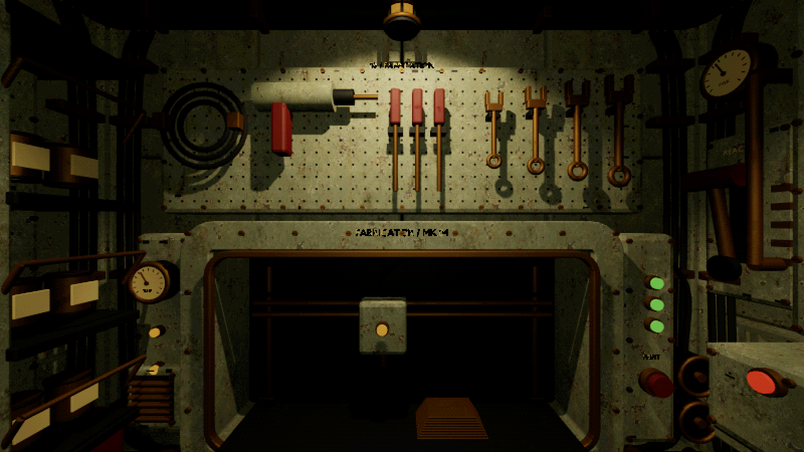
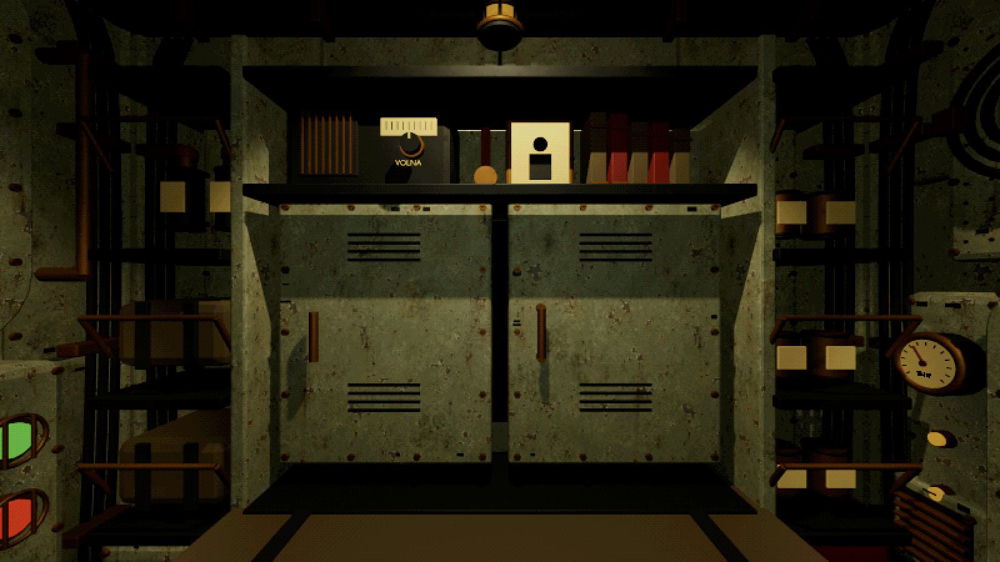
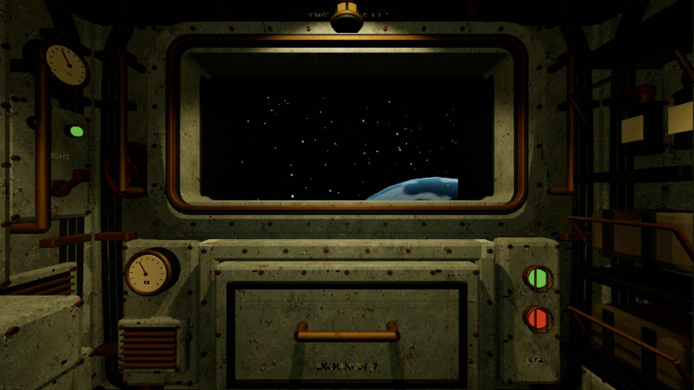
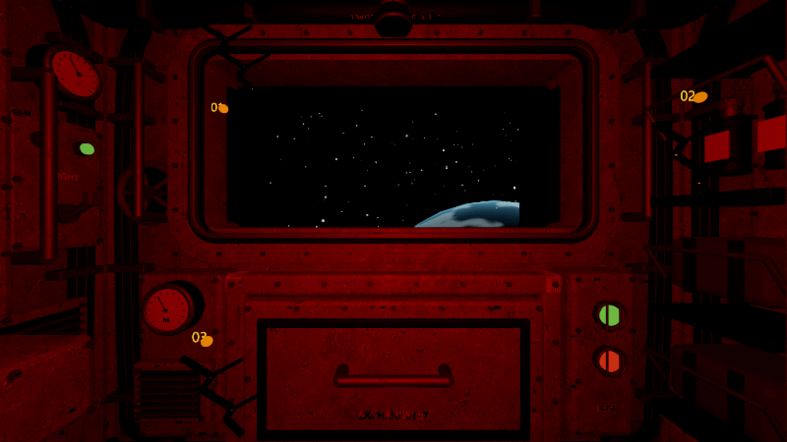
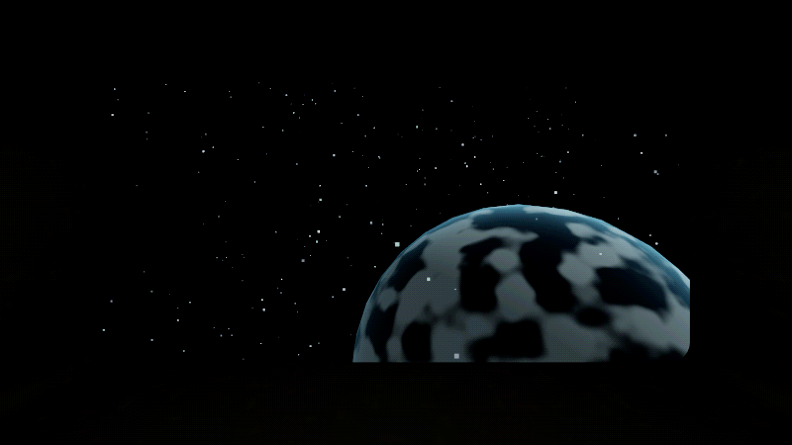
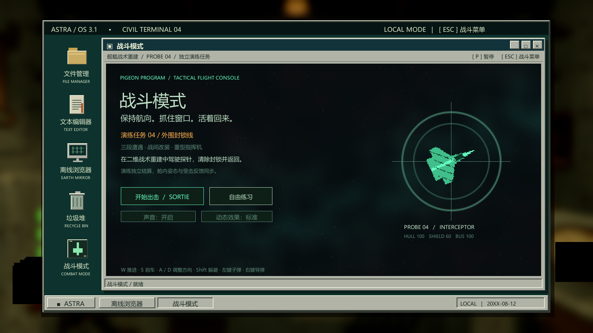
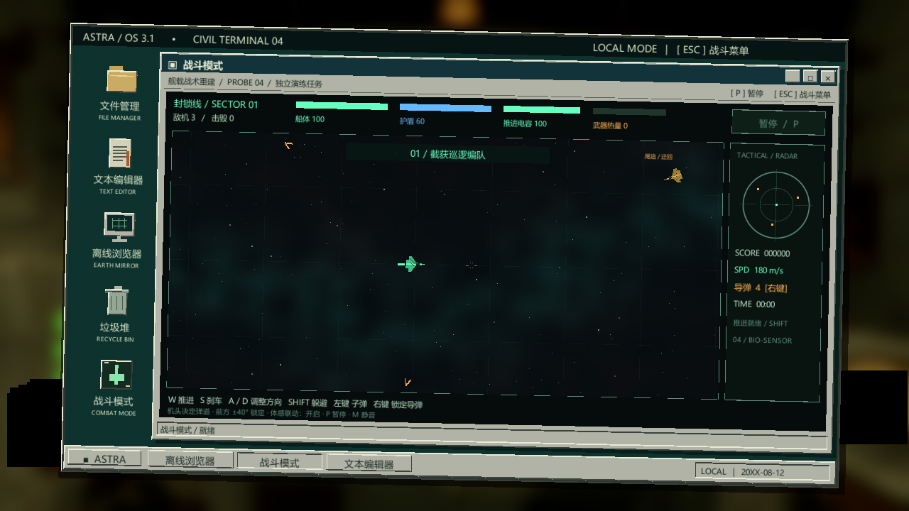

# Art_Shader 美术样板首版：保留锈蚀

2026-09-22 · 基于 c8d69af · Unity 2022.3.62f1 Built-in · Windows x64

**用户最新确认：保留原有锈蚀和斑驳，这种质感更符合项目。** 本版沿用原始锈蚀颜色贴图、掉漆参数、微法线和模型；调整灯光、高光、信号灯以及后处理。此前美术案 v1.0 中“大面积净化漆面”的建议不再作为实施默认值。

## 试玩与切换

打开 [Astra Art Sample.exe](<../../3D Demo/BuildArt/Astra Art Sample.exe>)。在舱室按 Esc，点击“画面”循环切换 **复古像素 → 清晰 → 网点**，再继续游戏。原有 Q/E 转墙、电脑、战斗及数字键演出保留。

默认“复古像素”：场景后处理按宽、高各二分之一处理，再以点过滤放大；24 级通道色阶与固定 4×4 Bayer 网点。清晰模式关闭色阶与像素化，保留本版材质、灯光和基础调色；它不是一键回到旧工程。桌面和 HUD 保持输出分辨率。

## A 墙同机位对照

使用原始中心机位，未改变模型与镜头参数。运行时控制器 FOV 为 75°。两次截图的 CRT 扫描角度随运行时间不同；这些都是引擎实际渲染，没有在外部软件中美化。

改造前：

保留锈蚀后的复古像素模式：

关闭像素化与网点后，可单独查看灯光及高光调整：

## 实现范围

- **旧化保留**：`WornMetal.shader`、原始 FBX 和 `NavalPaint_Albedo.png` 内容哈希与修改前一致。HullPaint 的颜色贴图贡献 0.88、细节贡献 0.78、微法线 0.28、程序掉漆 0.16 均保留；其 Smoothness 从 0.28 收敛至 0.22。
- **有限色阶**：`CabinGrade.shader` 在显示色空间量化，返回线性颜色交给最终输出转换；移除随时间变化的随机颗粒。网点固定在渲染像素网格上。
- **照明**：主聚光灯向舱内移出灯罩遮挡，重点照射设备；调整填充与警报暗阶段的可读性。相机前方最多两盏舱内聚光灯产生阴影；四盏点光不再生成立方体阴影。这个预算针对舱内照明，不限制演出自带的效果光。
- **信号灯**：新增 `Astra/SignalLamp`，固定保留可由原系统控制的发光路径，避免 Standard 发光变体在构建时丢失。保持红、绿含义及断电反馈。
- **界面与交互**：电脑背景仍走原有模糊流程，桌面文字、鼠标和战斗控制不参加场景像素化。暂停菜单新增画面选项。
- **制作入口**：`Astra/Art/Apply industrial art sample` 应用当前样板；`Astra/Art/Build Windows art sample` 输出到 `3D Demo/BuildArt`。正常 `Astra/Rebuild cabin scene` 也接入同一套配置，避免重建丢失本次风格。

## 其他画面

## 验证

| 范围 | 结果 | 证据 |
| --- | --- | --- |
| 美术专项 | 44 项通过 | [记录](<../../3D Demo/QA/ArtSample/ArtRelease/art-verification.txt>) |
| 舱室与电脑 | 130 项通过 | [记录](<../../3D Demo/QA/ArtSample/Cabin/verification.txt>) |
| 战斗与体感 | 113 项通过 | [记录](<../../3D Demo/QA/ArtSample/CombatVisible/combat-verification.txt>) |
| 九种演出 | 381 项通过 | [记录](<../../3D Demo/QA/ArtSample/Setpieces/setpiece-verification.txt>) |

总计 668 项通过。美术专项包括静止画面网点稳定、三种模式切换、两种输出分辨率、四墙阴影预算、断电、警报和鲸群。战斗使用可见窗口完成截图验证；第一次隐藏窗口运行的截屏错误没有作为通过结果计入。桌面控制连接被物理 Esc 中断，未另行声称已通过人工点击暂停菜单按钮；循环逻辑由专项检查覆盖。

工程在 NVIDIA GeForce RTX 4070 Laptop GPU 上进行图形验收。这不是目标低配机的帧率测量。像素化是后处理降采样，场景几何仍按相机分辨率绘制，并增加临时纹理与 Blit；不能据此宣称几何渲染成本下降。性能收益主要待对比确认减少动态阴影后的实际 GPU 时间。

本轮是材质保留、灯光与渲染样板。独立桌面 CRT、中文像素字体、批量替换 3D 模型及 2D 资产尚未在本轮制作。部分 B/D 墙铭牌本身的遮挡与合并网格问题仍可继续按资产修整。

## 维护入口

源码：`3D Demo/UnityProject/Assets/Astra`；打包入口：`Editor/CabinArtBuild.cs`；专项检查：启动程序时传入 `--astra-art-qa <输出目录>`，使用隔离 QA 文档存储。

Unity 技术依据：[Built-in OnRenderImage](https://docs.unity3d.com/2022.3/Documentation/ScriptReference/MonoBehaviour.OnRenderImage.html)、[Graphics.Blit](https://docs.unity3d.com/2022.3/Documentation/ScriptReference/Graphics.Blit.html)。现有玩法脚本通过相机效果之外的 UI 流程绘制桌面，故保持其输出清晰度。

## 2026-09-22 修复更新

已修复鼠标左右移动的阴影跳变及电脑背景两侧黑块，试玩仍使用 BuildArt。原截图保留为首版记录；请看[最新修复记录与实机截图](修复记录_光影与黑边.md)。
