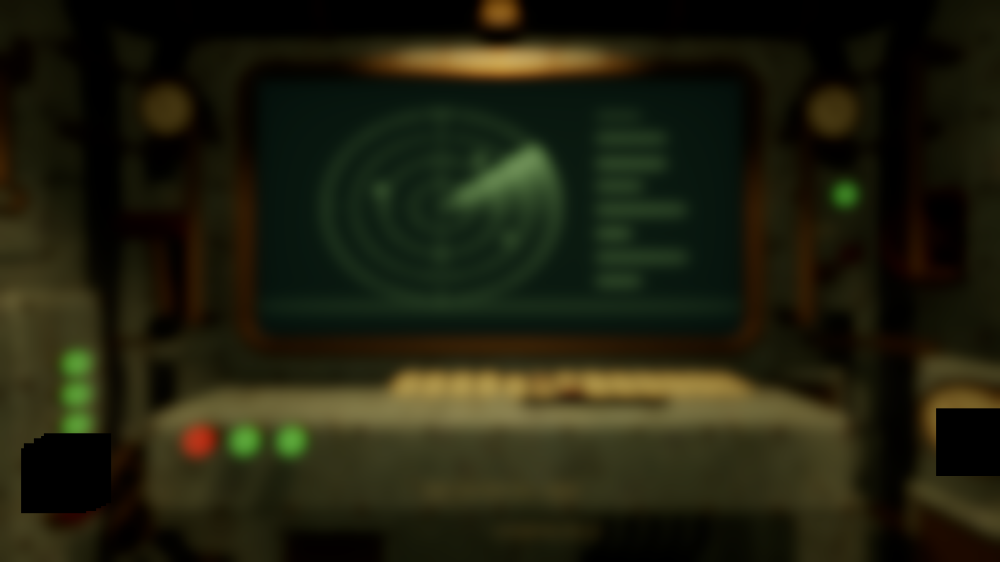
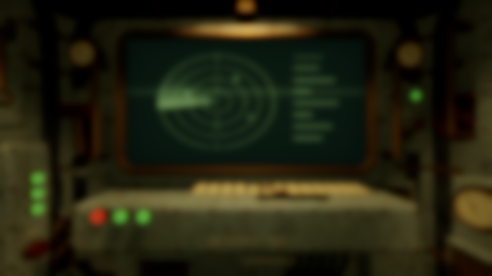
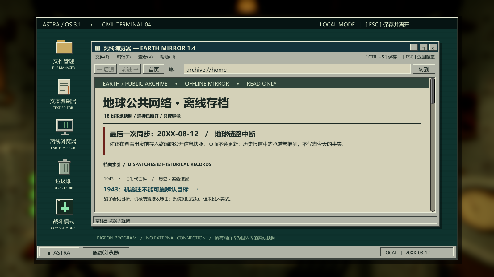
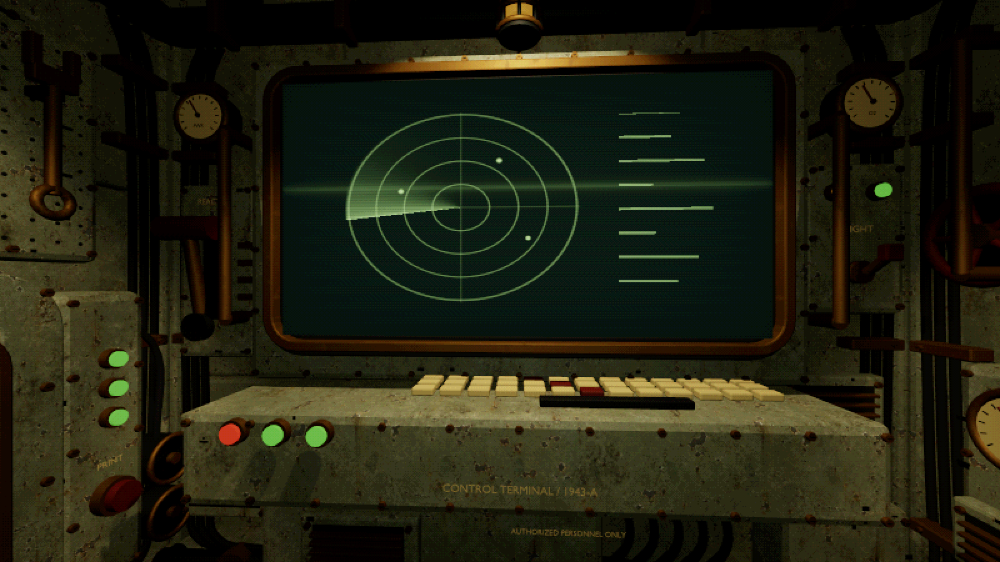
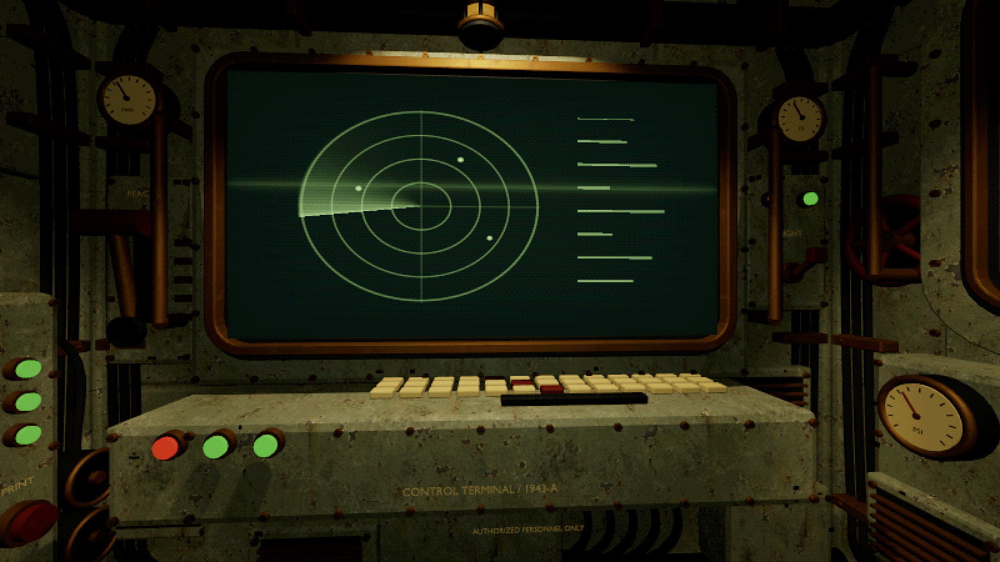

# 鼠标光影闪烁与桌面黑块修复

日期：2026-09-22。已更新 Art_Shader 源码与 `3D Demo/BuildArt/Astra Art Sample.exe`。

## 修复内容

- 鼠标左右移动时，阴影预算原先按实际相机朝向排序，两个侧墙灯在视角中线附近交换名次，导致阴影瞬间开关。现在只使用舱壁转向角和固定舱内中心进行选择，排除鼠标视差、近窗移动与战斗震动；Q/E 转向时，侧墙阴影先渐隐再交换。最多两盏聚光灯产生阴影。
- 旧金属 Shader 在退化切线处归一化零向量，产生无效 HDR 颜色值。背景模糊把孤立异常扩散成矩形黑块。改为带零长度保护的归一化及几何法线回退，并明确模糊临时纹理的双线性采样与边缘钳制。
- 锈蚀贴图、FBX、材质颜色和旧化参数均未修改。电脑窗口、战斗与交互规则保持原设置。

## 修复前后证据

| 检查 | 修复前 | 修复后 |
| --- | --- | --- |
| 四墙视角跨中线 0.002°，RGB 总差超过 12 的像素占比 | 9.4%–10.5% | 0.36%–0.43%，属于微小视差和像素采样变化 |
| 同一舱壁左右扫视的阴影灯切换 | 四面均发生 | 四面均稳定 |
| A 墙 1600×900 模糊前无效 HDR 像素 | 128 | 0；其余三面也为 0 |
| 720p / 900p / 1080p 两侧指定区域的纯黑平台 | 均复现 | 均为 0 |
| Q/E 双向各一圈 | — | 渐变连续，阴影峰值 2 盏 |

修复前的纯背景渲染（没有桌面 UI，黑块仍存在）：

修复后的同类背景渲染：

真实窗口中的电脑桌面：

鼠标左侧和右侧的视角，保留锈蚀外观：

## 回归验证

渲染专项 26 项、美术 44 项、战斗与体感 113 项、舱室与电脑 130 项，合计 313 项通过，无运行错误。

记录位于 `3D Demo/QA/RenderFix`。本轮在同一最终构建中完成上述检查；原演出全量检查的历史结果不计入本轮。没有新增性能测量承诺。

专项回归入口：`--astra-render-qa <输出目录>`；加 `--capture-desktop` 会在可见游戏窗口中保存完整桌面截图。QA 使用隔离文档存储。
